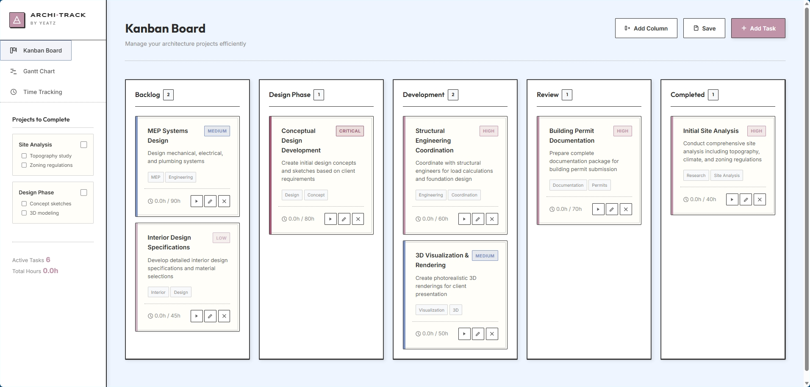

# ARCHI•TRACK

<div align="center">
  
  
  <br />
  <br />

  <h1>ARCHI • TRACK</h1>
  <p><strong>Professional Project Management for Architects</strong></p>

  <p>
    <a href="#features">Features</a> •
    <a href="#tech-stack">Tech Stack</a> •
    <a href="#installation">Installation</a> •
    <a href="#credits">Credits</a>
  </p>

  
  
  
</div>

<br />

## ⚡ Overview

**ARCHI•TRACK** is a specialized project management tool designed with the precision of architectural blueprints. It combines powerful task management with a distinct "Neo-Brutalist" aesthetic, offering architects and designers a focused environment to track projects, manage time, and visualize progress.

Unlike generic tools, ARCHI•TRACK feels like a digital studio—clean lines, technical typography, and distraction-free workflows.

## 📐 Features

### 📋 Kanban Board
*   **Drag & Drop Interface**: Intuitive management of tasks across Backlog, Design, Development, and Review phases.
*   **Priority Tagging**: Visual indicators for Low, Medium, High, and Critical tasks.
*   **Architectural Tags**: Pre-defined tags for common architectural phases (e.g., "MEP", "Schematic Design").

### 📊 Gantt Chart
*   **Timeline Visualization**: See your project schedule at a glance.
*   **Zoom Controls**: Switch between Day, Week, and Month views to manage granular details or big-picture deadlines.
*   **Auto-Sync**: Updates immediately when task dates are changed in the Kanban view.

### ⏱️ Time Tracking
*   **Billable Hours**: Track time spent on specific tasks with precision.
*   **Active Timer**: Always-on display of your current session.
*   **History Log**: Comprehensive list of recent time entries for easy billing and review.

### 📱 Responsive Design
*   **Mobile-First Sidebar**: Smooth, off-canvas navigation on smaller screens.
*   **Touch Optimized**: Large touch targets for tablets and mobile devices.
*   **Focus Mode**: Collapsible interface elements to maximize workspace.

## 🛠️ Tech Stack

*   **Core**: Semantic HTML5 & Vanilla JavaScript (ES6+)
*   **Styling**: Modern CSS3 (Variables, Grid, Flexbox)
*   **Fonts**: 
    *   *Syncopate* (Headers)
    *   *Space Grotesk* (Body)
    *   *Inter* (UI Elements)
*   **Storage**: LocalStorage (Persist data without a backend)

## 🚀 Getting Started

1.  **Clone the repository**
    ```bash
    git clone https://github.com/me-yeatz/ArchiTrack.git
    ```

2.  **Open the application**
    Simply open the `index.html` file in your preferred web browser. No build process or server required!

    ```bash
    # using a local server (recommended)
    npx serve .
    ```

## 📂 Project Structure

```text
/
├── index.html      # Landing Page
├── app.html        # Main Application Interface
├── app.js          # Core Application Logic
├── index.css       # App Styling
├── landing.css     # Landing Page Styling
└── public/         # Assets & Images
    └── Desktop_Screenshort.png
```

## 🎨 Design Philosophy

ARCHI•TRACK follows a **"Digital Blueprint"** design language:
*   **Strokes & Borders**: Heavy 2px-4px borders mimic drafting pens.
*   **Typography**: Technical, geometric fonts that resemble architectural lettering.
*   **Palette**: 
    *   *Drafting Paper* (Off-white background)
    *   *Graphite* (High contrast text)
    *   *Markup Pink* (Accents & Highlights)
    *   *Blueprint Blue* (Secondary accents)

## 👤 Credits

**Created by yeatz**

Designed for the intersection of Code & Architecture.

---

<div align="center">
  <p><i>Building the future, note by note.</i></p>
</div>
"# ArchiTrack" 
